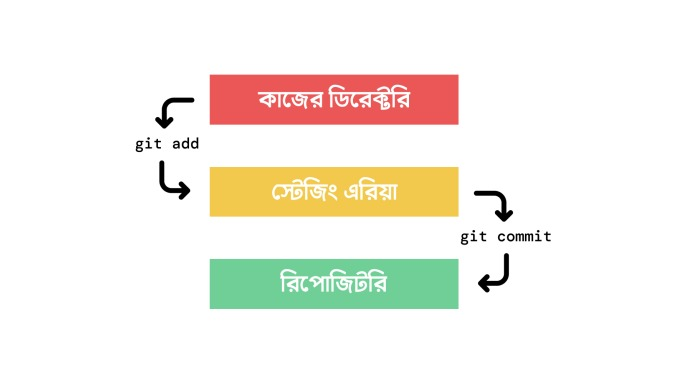

# **Git for me**

-  [Git Setup](#git-setup)
-  [Git Configure](#git-configure)
-  [Git Initialize](#git-initialize)
-  [Git Status](#git-status)
-  [Git Add](#git-add-স্টেজিং-এরিয়াতে-নেওয়া)
-  [Git Commit](#git-commit)
-  [Git Log](#git-log)
-  [Git Branch](#git-branch)
-  [Git Merge](#git-merge)
-  [ভার্সন/কমিটের মধ্যে পার্থক্য](#ভার্সনকমিটের-মধ্যে-পার্থক্য)
-  [Git Clone](#git-clone)
-  [অন্য কারো প্রজেক্টে কন্ট্রিবিউশন](#অন্য-কারো-প্রজেক্টে-কন্ট্রিবিউশন)
-  [Git Restore](#git-restore)
-  [Git Stash](#git-stash)
-  [Git Reset](#git-reset)
-  [Git Remove](#git-remove)

      <br>
      <br>

## Git Setup

**গিট ব্যবহার করতে হলে সিস্টেমে অবশ্যই **_Git Install_** করতে হবে। [Git SCM](https://git-scm.com) থেকে গিট ডাউনলোড করে install করা লাগবে।**
<br>

**গিট ঠিকমত ‍সেটআপ হয়েছে কিনা চেক করতে গিট install দেয়ার পর যে কোনো Terminal এ কমান্ড দিতে হবে...**

```bash
git --version
```

**এই কমান্ডে গিটের ভার্সন দেখালে বুঝতে হবে ‍গিট ঠিকমত install হয়েছে। এখন গিটের সব কাজ করতে পারব।**

<br>
<br>

## Git Configure

**গিটের গ্লোবাল কিছু কনফিগারেশন করে নিতে হবে নাম ও ইমেল দিয়ে...**

```bash
git config --global user.name userName
git config --global user.email userEmail
```

> -  এইটা ডিফল্ট ভাবে সব প্রজেক্টের জন্য।

এখন যদি একাধিক প্রজেক্টের জন্য একাধিক Email থাকে তাহলে ঐ প্রজেক্টে git initialize করার পর শুধুমাত্র সেই প্রজেক্টের জন্য userName & userEmail দিয়ে সেটআপ করতে হবে...

```bash
git config user.name userName
git config user.email userEmail
```

<br>
<br>

## Git Initialize

**যে folder/ডিরেক্টরি/রিপোজিটরি(repo) তে git ট্রেকিং এর কাজ করবে সেখানে git এর কার্যক্রম শুরু করতে git initialize করার জন্য...**

```bash
git init
```

<br>
<br>

## Git Status

**git এর বর্তমান অবস্থা/status জানতে...**

```bash
git status
```

> -  git status কমান্ডটি ব্যবহার করলে শুরুতে **_On branch main_** লেখা দেখতে পাওয়া যায়। এই main হলো বর্তমান ব্রাঞ্চের নাম। এবং এটাই প্রজেক্টের বর্তমান version.

<br>
<br>


<br>
<br>

## Git Add (স্টেজিং এরিয়াতে নেওয়া)

**নির্দিষ্ট কোন ফাইল স্টেজিং করতে...**

```bash
git add fileName
```

**লোকাল ডিরেক্টরির সব ফাইল স্টেজিং করতে...**

```bash
git add --all
#or
git add -A
```

**বর্তমান যে folder আছি ঐ folder এর সবকিছু স্টেজিং করতে...**

```bash
git add .
```

> -  root folder এ থাকা অবস্থায় `git add -A` এবং `git add -A` একই কথা।

**কোন ফাইল `git add` করে কমিট করার পরে যদি আবার `git add` এর আগের অবস্থায় ফিরে যেতে হয় বা আনট্রাকড অবস্থায় ফিরে যেতে হয় তাহলে....**

```bash
git reset HEAD~
```

<br>
<br>

<br>
<br>

## Git Commit

**কমিট হচ্ছে ফাইনাল সিদ্ধান্ত। স্টেজে রাখা file গুলো বা file এর চেন্জেস্ গুলো ঐ অবস্থার একটি version হিসেবে গিট লোকাল রিপোতে রাখতে। কমিটের সাথে একটি অর্থপূর্ণ ম্যাসেজ ও দিতে হই। যেন পরবর্তিতে বোঝা যায় কি কারণে কমিটটা করা হয়েছিল।**

```bash
git commit -m "commit message"
```

> -  ফাইল স্টেজিং এরিয়াতে নেওয়ার আগে কোন কিছু কমিট করা যাবেনা বা করতে পারব না।
> -  কমিট করা ফাইলে কোন পরিবর্তন করলে বা নতুন file create করলে সেই file আবার আনস্টেজ অবস্থায় চলে যায়।
> -  এই অবস্থায় `git status` চেক করলে ফাইল মডিফাইড দেখাবে এবং কোন ফাইল চেন্জ করা হয়েছে সেটা দেখাবে।
> -  এই পরিবর্তনকৃত ফাইল গুলোকে রাখতে হলে আবার ফাইল গুলো স্টেজে রাখতে হবে এবং ফইনাল কমিট করে git রিপোতে পাঠাতে হবে।
> -  ফাইল কমিট করা হয়ে গেলে ঐ ফাইলের একটি version রিপোতে তৈরি হয়ে যায়া
> -  এইভাবে প্রতিটি কমিটে git এর একটি করে version তৈরি হতে থাকবে।

**একটি কমিট থেকে অন্য কমিটে যেতে চাইলে...**

> -  কোন ফাইল বা ফোল্ডার আনকমিট অবস্থায় থাকলে চেক আউট করতে পারব না।

```bash
git checkout commitId
```

**লাষ্ট ভার্সন বা লাষ্ট কমিটে বা main virsion এ ফিরে যেতে...**

```bash
git checkout main
```

<br>
<br>

## Git Log

**রিপোতে করা কমিট গুলো এবং অন্যান্য ডিটেইলস্ দেখতে। এখান থেকে কমিট ম্যাসেজ এবং কমিট **_ID_** জানতে পারব...**

```bash
git log
```

**সুন্দর কম্প্যাক ভার্সনে ছোট করে প্রয়োজনীয় সব দেখতে...**

```bash
git log --oneline
```

<br>
<br>

## Git Branch

**নতুন ব্রাঞ্চ তৈরি করতে...**

```bash
git branch branchName
```

> -  যেই ব্রাঞ্চ থেকে নতুন ব্রাঞ্চ তৈরি করা হবে। নতুন ব্রাঞ্চ ঐ ব্রাঞ্চেরই একটি কপি হিসেবে তৈরি হবে।
> -  ব্রাঞ্চকেও একটি ভার্সন হিসেবে ধরা যেতে পারে।

**এক ব্রাঞ্চ থেকে অন্য ব্রাঞ্চে প্রবেশ করতে...**

```bash
git checkout branchName
#or
git switch branchName
```

**নতুন ব্রাঞ্চ তৈরি করে সাথে সাথে সেই ব্রাঞ্চে প্রবেশ করতে...**

```bash
git checkout -b branchName
```

**প্রজেক্টে থাকা সবগুলো ব্রাঞ্চের লিস্ট দেখতে...**

```bash
git branch
#or
git branch --list
```

**কোন ব্রাঞ্চ ডিলিট করতে...**

```bash
git branch -D branchName
```

> -  ব্রাঞ্চে কোন মোডিফিকেশন থাকলে সেটাও ডিলিট হয়ে যাবে।
> -  তবে যদি `-D` এর পরিবর্তে `-d` দেওয়া হয় তাহলে ঐ ব্রাঞ্চে কিছু আনকমিট থাকলে গিট warning দিবে।

**কোন branch এর নাম চেন্জ করতে হলে ঐ branch এ থাকা অবস্থায়...**

```bash
git branch -m newBranchName
```

<br>
<br>

## Git Merge

**একটা ব্রাঞ্চের সাথে অন্য একটা ব্রাঞ্চের পরিবর্তন ‍সংযোজন একত্রিত করতে গিট মার্জ করা হয়। যেই ব্রাঞ্চে মার্জ করতে চাচ্ছি সেই ব্রাঞ্চে থাকা অবস্থায় মার্জ কমান্ড দিতে হবে।**

```bash
git merge branchName
```

> -  মার্জ করলে ঐ ব্রাঞ্চের কমিট গুলো ও অ্যাড হয়ে যাবে।

<br>
<br>

## ভার্সন/কমিটের মধ্যে পার্থক্য

**দুইটা কমিটের মধ্যে পার্থক্য বা দুইটা কমিটে কোন ফাইলে ঠিক কিকি রিমুভ (লাল) এবং অ্যাড (সবুজ) করা হয়েছে সেগুলো দেখতে...**

```bash
git diff 1stCommitId 2ndCommitId
```

<br>
<br>

## Git Clone

**রিমট প্রজেক্ট লোকাল মেশিনে কপি করার জন্য...**

```bash
git clone githubRepoUrl localDirectoryName(optional)
```

> -  Local directory name না দিলে রিমট রিপো যে নামে সেই নামেই ডিফল্ট লোকাল ডিরেক্টরি হয়ে যাবে।
> -  এখন আমি যদি এই প্রজেক্টের কন্ট্রিবিউটর হয় তাহলে কোড মডিফাই করার পর এই রিমটে পুশকরতে পারব, না হলে এই রিমটে পুশ হবে না।

<br>
<br>

## অন্য কারো প্রজেক্টে কন্ট্রিবিউশন

অন্য কারো প্রজেক্টে কন্ট্রিবিউট করতে হলে সেই প্রজেক্টে **Pull request** পাঠাতে হবে।

এজন্য ঐ প্রজেক্টটা আগে নিজের গিটহাবে **Fork** করতে হবে।

-  এটা অনেকটা ক্লোন করার মতই ঐ প্রজেক্টের বর্তমান ভার্সনটা আমার গিটহাবে ক্লোন হয়ে যাবে।
-  আমার গিটহাবে প্রজেক্ট ফর্ক করার পরও এটা কোনভাবে মেইন প্রজেক্টের সাথে লিঙ্কড থাকে যাতে আরোকিছু জিনিস পরে করা যায়।

এখন আমার গিটহাব রিপোতে একই নামে একটা রিপো তৈরি হয়েছে। এই রিপোটা এখন আমার লোকালে **Clone** করে মডিফাই করে কমিট করে আমার গিটহাবে পুশ করতে পারব।

এখন আমার **Fork** করা রিপোতে আমার কমিট দেখতে পাব। কমিট দেখানোর ঐখানে **Contribute** নামে একটা বাটন থাকবে ওখানে ক্লিক করলে মেইন প্রজেক্টের সাথে অমার **Fork** করা প্রজেক্টের পরিবর্তন গুলো দেখাবে।

> -  এখানে যদি **Able to marge** থাকে তাহলে বুঝতে হবে মেইন প্রজেক্টে কোন পরিবর্তন হয় নাই।
> -  কিন্তু **Con't automatically merge** লেখা থাকলে বুঝতে হবে মেইন প্রজেক্টে পরিবর্তন হয়েছে।

এখন আমার চেন্জের একটা টাইটেল আর চাইলে চেন্জের কিছু তথ্য কমেন্ট হিসেবে দিয়ে **Create pull request** ক্লিক করে পুল রিকোয়েস্ট তৈরি করতে পারি।

> -  অনেক সময় টাইটেল ফিল্ডে আমার করা চেঞ্জ বা চেঞ্জের ম্যাসেজ বাই ডিফল্ট পূরণ করা থাকতে পারে।

এখন মেইন কন্ট্রিবিউটর আমার চেন্জ মার্জ করলে আমিও সে প্রজেক্টের কন্ট্রিবিউটর লিস্টে এ্যাড হয়ে যাবো।

<br>
<br>

## Git Restore

**এটা মূলত লোকাল আনকমিটেড চেন্জেস গুলোকে আনডু (শেষ কমিটের অবস্থায়) করতে ব্যবহার হয়।**

```bash
git restore fileName
#or
git restore directoryName
#0r
git restore .
```

**চেন্জ করা কিছু যদি অলরেডি git add করে স্টেজিং এ নেয়া হলে তাকে অনডু করতে প্রথমে নিচের কমান্ডটা তারপর উপরের কমান্ড।**

```bash
git restore --staged fileName
#or
git restore --staged directoryName
#or
git restore --staged .
```

<br>
<br>

## Git Stash

**একটা কাজের মধ্যে আছি কিন্তু ‍কমিট করার মত অবস্থায় নাই। কাজের কোন একটা অংশ হয়েছে মাত্র। এমন অবস্থায় branch পরিবর্তন করতে হলে `git stash` কমান্ড কজে দিবে। git stash কমান্ড দিয়ে অর্ধেক কাজটা এক পাশে ফেলে রেখে অন্য ব্রাঞ্চে কাজ করা যাবে। এবং কাজ শেষে ফিরে এসে আরেটা কমান্ড দিয়ে ফেলে রাখা কাজ গুলো ফিরে পাওয়া যাবে।**

**অর্ধেক কাজ বা কমিট না করা কাজ এক পাশে ফেলে রাখার জন্য---**

```bash
git stash
```

**কমান্ডটি দেওয়ার সাথে সাথে আনকমিট করা কাজ গুলো নাই হয়ে যাবে। ভয় পাওয়ার কিছু নাই। এখন অন্য ব্রাঞ্চে গিয়ে কাজ করা যাবে।**

**অন্য ব্রাঞ্চ থেকে ফিরে এসে আনকমিট কাজ গুলো ফিরে পেতে---**

```bash
git stash pop
```

> -  মনে রাখতে হবে এই কমান্ডটি সর্বশেষ stash করা কাজগুলো ব্যাক করবে এবং stash লিস্ট থেকেও ক্লিয়ার করে দিবে।
> -  তবে stash এ একাধিক চেন্জেস রাখতে পারা যাবে। সেক্ষেত্রে `stash pop` দিতে থাকলে সবার শেষে অ্যাড করা চেন্জেস গুলো প্রথম হিসেবে পর্যায়ক্রমে আসতে থাকবে।

**আবার যদি চাই যে চেন্জেস গুলো ফিরিয়ে আনবো আবার স্ট্যাশেও রেখে দিব তাহলে নিচের কমান্ডটা ব্যবহার করতে হবে---**

```bash
git stash apply
```

**যেটা স্ট্যাশে রাখা হলো সেটা দেখার জন্য---**

```bash
git stash show -p
```

**যেহেতু স্ট্যাশে একাধিক চেন্জেস রাখা যায় তাই স্ট্যাশের লিস্ট দেখতে---**

```bash
git stash list
```

**এখন এ লিস্টে দেখা যাবে প্রতিটা আইটেমের আগে stash@{idNumber} দিয়ে মার্ক করা আছে। এটা ব্যবহার করেও pop অথবা apply করা যাবে---**

```bash
git stash pop idNumber
#or
git stash apply idNumber
```

**stash লিস্ট ক্লিয়ার করে ফেলতে চাইলে---**

```bash
git stash clear
```

**কোন নির্দিষ্ট একটা আইটেম স্ট্যাশ থেকে রিমুভ করতে চাইলে---**

```bash
git stash drop idNumber
```

তবে একটা বিষয় অবশ্যই খেয়াল রাখতে হবে, সেটা হচ্ছে `stash` কমান্ডটি এভাবে ব্যবহার করলে অলরেডি গিটে ট্রাক করা ফাইল বা ডিরেক্টরির চেন্জেস গুলোই স্ট্যাশে রাখবে।

কিন্তু শেষ কমিটের পর যদি একেবারে নতুন কোন ফাইল অথবা ডিরেক্টরি অ্যাড করা হয়ে থাকে তাহলে সেগুলো এভবে স্ট্যাশে যাবে না। সেক্ষেত্রে একটি ফ্ল্যাগ ব্যবহার করে গিটকে বলে দিতে হবে যে আমি নতুন ফাইল, ডিরেক্টরি গুলোও স্ট্যাশে নিতে চাচ্ছি---

```bash
git stash -u
```

<br>
<br>

## Git Reset

**পুরপুরি রেডি না এমন কোড ভুলে কমিট করে ফেললে পূর্বের আনকমিট অবস্থায় ফিরে যেতে বা স্পেসেফিক কোন কমিটের পরবর্তী চেন্জেস গুলো আনডু করতে চাইলে---**

```bash
git reset commitId
```

> -  এক্ষেত্রে উক্ত কমিটের পরবর্তী যে যে চেন্জেস ‍গুলো ছিলো সেগুলো আনকমিট অবস্থায় চলে যাবে।

তবে যদি চাই উক্ত কমিটের পরবর্তী যে যে চেন্জেস গুলো ছিলো সে গুলো একে বারে চলে যাক তাহলে---

```bash
git reset commitId --hard
#or
git reset --hard commitId
```

> -  তবে মনে রাখতে হবে, অলরেডি গিটহাবে উক্ত কমিট সহ পুশ করে ফেলেছি তাহলে এটা ব্যবহার করে রিসেট করাটা রিকমেন্ডেড না। এতে অনান্য কন্ট্রবিউটর বা কোলাবরেটররা কনফিউজড হয়ে যেতে পারে হঠাত একটা কমিট উধাও হয়ে গেলে।

> -  **ঔ রকম পরিস্থিতিতে `git revert` কমান্ড বেশি ইউজফুল।**

> -  কোন ফাইল `git add` করার পরে যদি `git reset` দেওয়া হয় তাহলে সেটা আবার আন্ট্রাক্ড অবস্থায় ফিরে যায়।

> -  `git reset --hard` দেওয়ার পরে git log এ আর ঐ কমিট গুলো দেখাই না।

**কিন্তু**

```bash
git reflog
```

কমান্ডটা দিলে এখানে সব কিছু দেখাবে। একটা কমিট এক সময় ‍ছিলো এখন নেই, সেই কমিট id টাও পাওয়া যাবে। এবং reset করে সেই কমিটে ফিরে এ যেতে পারবে।

<br>
<br>

## Git Remove

```bash
git rm fileName
```

**এই কমান্ডটা দিলে ফাইল আনট্রাক হয়ে যাবে েএবং ফাইল রিমুভ হয়ে যাবে।**

```bash
git rm --cached fileName
```

এই কমান্ডের মাধ্যমে ফাইলটা ট্রাকিং থেকে বাদ দিয়ে দেবে গিট। কিন্তু ডিলিট করবেনা ওয়ার্কিং ডিরেক্টরি থেকে। কিন্ত লোকাল ডিরেক্টরিতে কমিট করা থাকলে সেটা ডিলিট করে দিবে।

## etc

রিমট ডিরেক্টরিতে কোন পরিবর্তন করা হলে তা ওয়ার্কিং ডিরেক্টরিতে আনতে হলে....

```bash
git fetch
```

> -  fetch করার পর ও পরিবর্তন গুলো দেখাবে না। তার জন্য `git merge` দিতে হবে। তাহলে সব পরিবর্তন দেখা যাবে।

```bash
git pull
```

> -  **`git pull` কমান্ড ব্যবহার করলে fetch এবং merge এর কাজ দুইটা একবারে করে ফেলবে। লোকালের যে ব্রাঞ্চে থেকে করব রিমটের সেই ব্রাঞ্চে হবে।**

for prevew `ctrl+k v`
