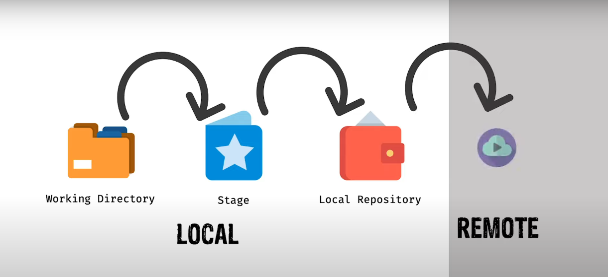

# **Git for me**

-  [Git Initialize](#git-initialize)
-  [Git Status](#git-status)
-  [Git Add](#git-add-স্টেজিং-এরিয়াতে-নেওয়া)
-  [Git Commit](#git-commit)
-  [Git Log](#git-log)
-  [Git Branch](#git-branch)
-  [Git Merge](#git-merge)
-  [ভার্সন/কমিটের মধ্যে পার্থক্য](#ভার্সনকমিটের-মধ্যে-পার্থক্য)
-  [Git Clone](#git-clone)
-  [অন্য কারো প্রজেক্টে কন্ট্রিবিউশন](#অন্য-কারো-প্রজেক্টে-কন্ট্রিবিউশন)

    <br>
    <br>

## Git Setup

গিট ব্যবহার করতে হলে সিস্টেমে অবশ্যই [**_Git Install_**](https//:git-scm.com) করতে হবে।

## Git Initialize

**যে folder/ডিরেক্টরি/রিপোজিটরি(repo) তে git ট্রেকিং এর কাজ করবে সেখানে git এর কার্যক্রম শুরু করতে git initialize করার জন্য...**

```bash
git init
```

<br>
<br>

## Git Status

**git এর বর্তমান অবস্থা/status জানতে...**

```bash
git status
```

> -  git status কমান্ডটি ব্যবহার করলে শুরুতে **_On branch main_** লেখা দেখতে পাওয়া যায়। এই main হলো বর্তমান ব্রাঞ্চের নাম। এবং এটাই প্রজেক্টের বর্তমান version.

<br>
<br>


<br>
<br>

## Git Add (স্টেজিং এরিয়াতে নেওয়া)

**নির্দিষ্ট কোন ফাইল স্টেজিং করতে...**

```bash
git add fileName
```

**লোকাল ডিরেক্টরির সব ফাইল স্টেজিং করতে...**

```bash
git add --all
#or
git add -A
```

**বর্তমান যে folder আছি ঐ folder এর সবকিছু স্টেজিং করতে...**

```bash
git add .
```

> -  root folder এ থাকা অবস্থায় `git add -A` এবং `git add -A` একই কথা।

<br>
<br>

## Git Commit

**কমিট হচ্ছে ফাইনাল সিদ্ধান্ত। স্টেজে রাখা file গুলো বা file এর চেন্জেস্ গুলো ঐ অবস্থার একটি version হিসেবে গিট লোকাল রিপোতে রাখতে। কমিটের সাথে একটি অর্থপূর্ণ ম্যাসেজ ও দিতে হই। যেন পরবর্তিতে বোঝা যায় কি কারণে কমিটটা করা হয়েছিল।**

```bash
git commit -m "commit message"
```

> -  ফাইল স্টেজিং এরিয়াতে নেওয়ার আগে কোন কিছু কমিট করা যাবেনা বা করতে পারব না।
> -  কমিট করা ফাইলে কোন পরিবর্তন করলে বা নতুন file create করলে সেই file আবার আনস্টেজ অবস্থায় চলে যায়।
> -  এই অবস্থায় `git status` চেক করলে ফাইল মডিফাইড দেখাবে এবং কোন ফাইল চেন্জ করা হয়েছে সেটা দেখাবে।
> -  এই পরিবর্তনকৃত ফাইল গুলোকে রাখতে হলে আবার ফাইল গুলো স্টেজে রাখতে হবে এবং ফইনাল কমিট করে git রিপোতে পাঠাতে হবে।
> -  ফাইল কমিট করা হয়ে গেলে ঐ ফাইলের একটি version রিপোতে তৈরি হয়ে যায়া
> -  এইভাবে প্রতিটি কমিটে git এর একটি করে version তৈরি হতে থাকবে।

**একটি কমিট থেকে অন্য কমিটে যেতে চাইলে...**

> -  কোন ফাইল বা ফোল্ডার আনকমিট অবস্থায় থাকলে চেক আউট করতে পারব না।

```bash
git checkout commitId
```

**লাষ্ট ভার্সন বা লাষ্ট কমিটে বা main virsion এ ফিরে যেতে...**

```bash
git checkout main
```

<br>
<br>

## Git Log

**রিপোতে করা কমিট গুলো এবং অন্যান্য ডিটেইলস্ দেখতে। এখান থেকে কমিট ম্যাসেজ এবং কমিট **_ID_** জানতে পারব...**

```bash
git log
```

**সুন্দর কম্প্যাক ভার্সনে ছোট করে প্রয়োজনীয় সব দেখতে...**

```bash
git log --oneline
```

<br>
<br>

## Git Branch

**নতুন ব্রাঞ্চ তৈরি করতে...**

```bash
git branch branchName
```

> -  যেই ব্রাঞ্চ থেকে নতুন ব্রাঞ্চ তৈরি করা হবে। নতুন ব্রাঞ্চ ঐ ব্রাঞ্চেরই একটি কপি হিসেবে তৈরি হবে।
> -  ব্রাঞ্চকেও একটি ভার্সন হিসেবে ধরা যেতে পারে।

**এক ব্রাঞ্চ থেকে অন্য ব্রাঞ্চে প্রবেশ করতে...**

```bash
git checkout branchName
#or
git switch branchName
```

**নতুন ব্রাঞ্চ তৈরি করে সাথে সাথে সেই ব্রাঞ্চে প্রবেশ করতে...**

```bash
git checkout -b branchName
```

**প্রজেক্টে থাকা সবগুলো ব্রাঞ্চের লিস্ট দেখতে...**

```bash
git branch
#or
git branch --list
```

**কোন ব্রাঞ্চ ডিলিট করতে...**

```bash
git branch -D branchName
```

> -  ব্রাঞ্চে কোন মোডিফিকেশন থাকলে সেটাও ডিলিট হয়ে যাবে।
> -  তবে যদি `-D` এর পরিবর্তে `-d` দেওয়া হয় তাহলে ঐ ব্রাঞ্চে কিছু আনকমিট থাকলে গিট warning দিবে।

<br>
<br>

## Git Merge

**একটা ব্রাঞ্চের সাথে অন্য একটা ব্রাঞ্চের পরিবর্তন ‍সংযোজন একত্রিত করতে গিট মার্জ করা হয়। যেই ব্রাঞ্চে মার্জ করতে চাচ্ছি সেই ব্রাঞ্চে থাকা অবস্থায় মার্জ কমান্ড দিতে হবে।**

```bash
git merge branchName
```

> -  মার্জ করলে ঐ ব্রাঞ্চের কমিট গুলো ও অ্যাড হয়ে যাবে।

<br>
<br>

## ভার্সন/কমিটের মধ্যে পার্থক্য

**দুইটা কমিটের মধ্যে পার্থক্য বা দুইটা কমিটে কোন ফাইলে ঠিক কিকি রিমুভ (লাল) এবং অ্যাড (সবুজ) করা হয়েছে সেগুলো দেখতে...**

```bash
git diff 1stCommitId 2ndCommitId
```

<br>
<br>

## Git Clone

**রিমট প্রজেক্ট লোকাল মেশিনে কপি করার জন্য...**

```bash
git clone githubRepoUrl localDirectoryName(optional)
```

> -  Local directory name না দিলে রিমট রিপো যে নামে সেই নামেই ডিফল্ট লোকাল ডিরেক্টরি হয়ে যাবে।
> -  এখন আমি যদি এই প্রজেক্টের কন্ট্রিবিউটর হয় তাহলে কোড মডিফাই করার পর এই রিমটে পুশকরতে পারব, না হলে এই রিমটে পুশ হবে না।

<br>
<br>

## অন্য কারো প্রজেক্টে কন্ট্রিবিউশন

অন্য কারো প্রজেক্টে কন্ট্রিবিউট করতে হলে সেই প্রজেক্টে **Pull request** পাঠাতে হবে।

এজন্য ঐ প্রজেক্টটা আগে নিজের গিটহাবে **Fork** করতে হবে।

-  এটা অনেকটা ক্লোন করার মতই ঐ প্রজেক্টের বর্তমান ভার্সনটা আমার গিটহাবে ক্লোন হয়ে যাবে।
-  আমার গিটহাবে প্রজেক্ট ফর্ক করার পরও এটা কোনভাবে মেইন প্রজেক্টের সাথে লিঙ্কড থাকে যাতে আরোকিছু জিনিস পরে করা যায়।

এখন আমার গিটহাব রিপোতে একই নামে একটা রিপো তৈরি হয়েছে। এই রিপোটা এখন আমার লোকালে **Clone** করে মডিফাই করে কমিট করে আমার গিটহাবে পুশ করতে পারব।

এখন আমার **Fork** করা রিপোতে আমার কমিট দেখতে পাব। কমিট দেখানোর ঐখানে **Contribute** নামে একটা বাটন থাকবে ওখানে ক্লিক করলে মেইন প্রজেক্টের সাথে অমার **Fork** করা প্রজেক্টের পরিবর্তন গুলো দেখাবে।

> -  এখানে যদি **Able to marge** থাকে তাহলে বুঝতে হবে মেইন প্রজেক্টে কোন পরিবর্তন হয় নাই।
> -  কিন্তু **Con't automatically merge** লেখা থাকলে বুঝতে হবে মেইন প্রজেক্টে পরিবর্তন হয়েছে।

এখন আমার চেন্জের একটা টাইটেল আর চাইলে চেন্জের কিছু তথ্য কমেন্ট হিসেবে দিয়ে **Create pull request** ক্লিক করে পুল রিকোয়েস্ট তৈরি করতে পারি।

> -  অনেক সময় টাইটেল ফিল্ডে আমার করা চেঞ্জ বা চেঞ্জের ম্যাসেজ বাই ডিফল্ট পূরণ করা থাকতে পারে।

এখন মেইন কন্ট্রিবিউটর আমার চেন্জ মার্জ করলে আমিও সে প্রজেক্টের কন্ট্রিবিউটর লিস্টে এ্যাড হয়ে যাবো।
